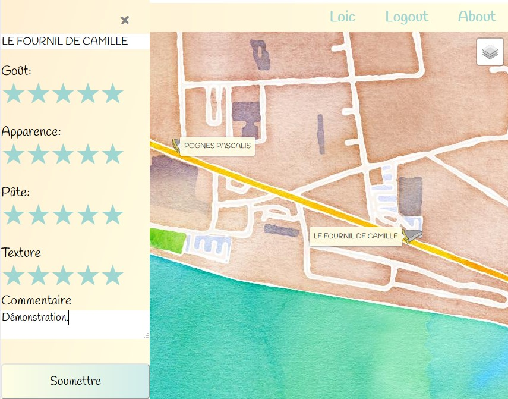

# flantastic

[](https://travis-ci.org/Simarra/django-flantastic)

[](https://badge.fury.io/py/django-flantastic)


An app to found the best puddings of France!




## Purpose
This is a web application wich shows a map with points wich are bakeries. Each bakerie has notation based on some criterias, like taste, texture...

The votes of users are processed to color the points on the map and shown the "best" bakeries.

## Installation
- Python >=3.6
- [Geodjango dependencies](https://docs.djangoproject.com/en/2.2/ref/contrib/gis/install/)

Start a django app and then pip install django-flantastic.

Then configure settings.py as you want, you can use postgis or Spatialite database as you wich.

Optional setting are: 
- FLANTASTIC_CLOSEST_ITEMS_NB: *Choose how many items are shown each time user move the map*

### Import initial data
A script is ready to get bakeries from Christian Quest (Thank you!! ) geocoded SIRENE file data and import it into your database.

```sh
python manage.py migrate
python manage.py import_initial_data


